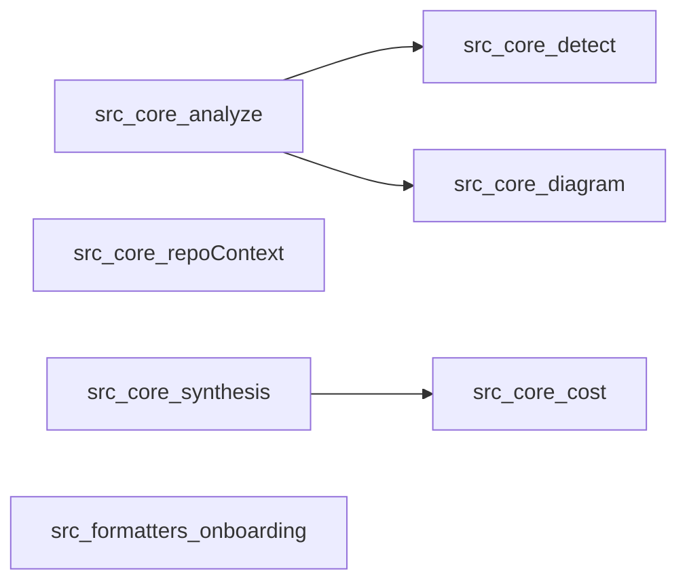

# Repo context for Claude

> Auto-generated by spine on 2026-05-02. content hash: da0842d29069. commit: a9edc15.
> Refresh with `/onboard` (or `npm run onboard -- .`).
> Re-run when this hash no longer matches the current source.

## Project shape
**spine** is a `cli` written primarily in `typescript`.

## Mental model
Treat the command surface as the product: startup, argument flow, and the first handoff into core logic explain most of the system.

## Verified architecture
The following 7 files form the verified spine; every edge below is backed by static analysis.

## Subsystems
- **Tests** — `tests/**`. Skip unless you need to understand or extend coverage.
- **Core** — `src/**`. Skip unless you need the central control flow or shared abstractions.
- **Benchmarks** — `benchmarks/**`. Skip unless your task touches the benchmarks area directly.
- **Docs** — `docs/**`. Skip unless you are updating docs or looking for usage guidance.

## Entry points
- `src/cli.ts` — Declared as package.json bin.
- `src/index.ts` — Conventional TypeScript module entry.

Tip: this file is a snapshot. If the spine you read here looks stale, re-run `/onboard` to refresh.
