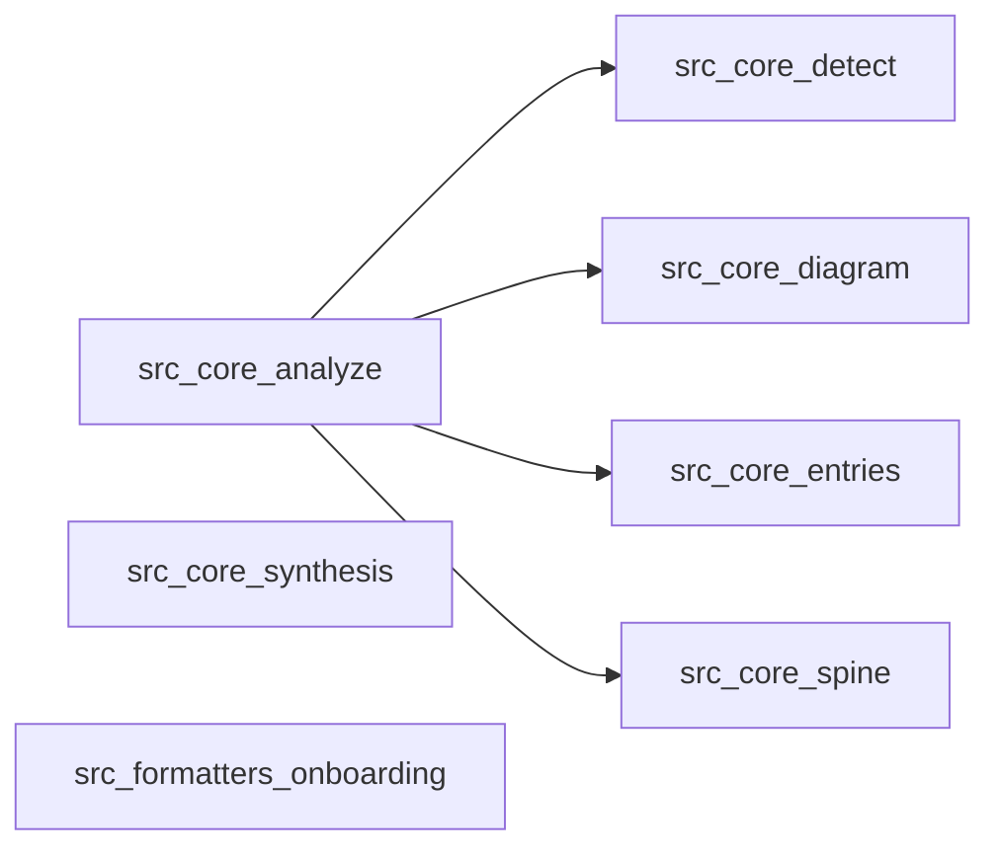

# Onboarding tour: spine

## TL;DR
This repository is a cli built primarily in typescript. The verified spine currently runs through `src/core/analyze.ts`, `src/core/synthesis.ts`, `src/formatters/onboarding.ts`. The architecture diagram is derived from verified static-analysis edges only.

## Architecture map

View / edit on [mermaid.live](https://mermaid.live/view#pako:eNp9kMEKwjAQRH8l7Ln9gRw8efSkV6GsyaYNNIlsNkgt_Xer4iEQvD5mmMesYJIl0ODm9DATsqjT-RqVymwGk5gGjDgvT6pYXqJMlH3-UZc4oAhxHlK8JWTr41hVLAkZqZHHkTFUjKKwp1yv3X2klpPq-8PfhXauMdsMtlyawY8gdBBof8Fb0Cvs94T3rZYclllg6wCLpMsSDWjhQh2Uu0Wh49cGtMM50_YCMvuUEg)

Legend:
- `src_core_analyze` = `src/core/analyze.ts`
- `src_core_synthesis` = `src/core/synthesis.ts`
- `src_formatters_onboarding` = `src/formatters/onboarding.ts`
- `src_core_detect` = `src/core/detect.ts`
- `src_core_diagram` = `src/core/diagram.ts`
- `src_core_entries` = `src/core/entries.ts`
- `src_core_spine` = `src/core/spine.ts`

Every edge above is verified by static analysis. Edges the tool couldn't verify are omitted, not guessed.

## Mental model
Treat the command surface as the product: startup, argument flow, and the first handoff into core logic explain most of the system.

## Reading order
- `src/core/analyze.ts` - This file sits on the verified architecture spine and explains the main runtime handoff.
- `src/core/synthesis.ts` - This file sits on the verified architecture spine and explains the main runtime handoff.
- `src/formatters/onboarding.ts` - This file sits on the verified architecture spine and explains the main runtime handoff.
- `src/core/detect.ts` - This file sits on the verified architecture spine and explains the main runtime handoff.
- `src/core/diagram.ts` - This file sits on the verified architecture spine and explains the main runtime handoff.
- `src/core/entries.ts` - This file sits on the verified architecture spine and explains the main runtime handoff.
- `src/core/spine.ts` - This file sits on the verified architecture spine and explains the main runtime handoff.
- `src/cli.ts` - This is a detected entry point, so it shows how execution begins.
- `src/index.ts` - This is a detected entry point, so it shows how execution begins.
- `README.md` - Defines a key project contract or context file.
- `package.json` - Defines a key project contract or context file.
- `tsconfig.json` - Defines a key project contract or context file.

## Entry points found
- src/cli.ts - Declared as package.json bin.
- src/index.ts - Conventional TypeScript module entry.

## Subsystems
### Tests
What it does: Test coverage and verification logic.
Where it lives: `tests/**`
Entry point: `tests/analyze.test.ts`
Skip unless: Skip unless you need to understand or extend coverage.

### Benchmarks
What it does: Files grouped around the benchmarks part of the codebase.
Where it lives: `benchmarks/**`
Entry point: `benchmarks/README.md`
Skip unless: Skip unless your task touches the benchmarks area directly.

### Core
What it does: Core orchestration and shared runtime behavior.
Where it lives: `src/core/**`
Entry point: `src/core/repository.ts`
Skip unless: Skip unless you need the central control flow or shared abstractions.

### Types.ts
What it does: Files grouped around the types.ts part of the codebase.
Where it lives: `src/**`
Entry point: `src/types.ts`
Skip unless: Skip unless your task touches the types.ts area directly.

## Gotchas
- Detected CLI bin entry.
- The architecture diagram is intentionally incomplete where static analysis could not verify an edge.

## Estimated read time
56 minutes for the spine, 2.8 hours for fuller coverage.
