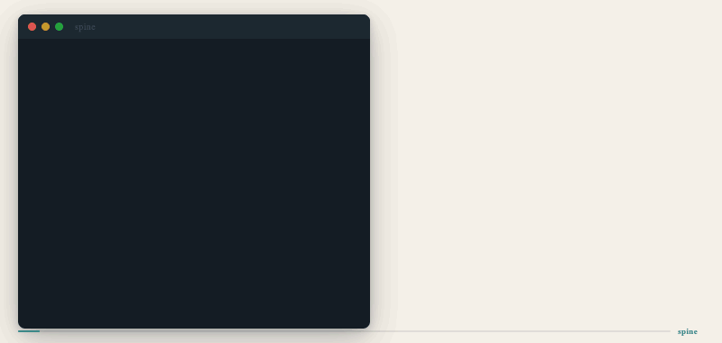

# spine

`spine` turns an unfamiliar repository into a verified onboarding guide.
[](https://www.npmjs.com/package/@spine-io/onboard) [](https://www.npmjs.com/package/@spine-io/onboard)



In one run it gives you:

- a small architecture diagram built from verified static-analysis edges only
- a prioritized reading order for the files that matter first
- a short mental model, subsystem summary, and gotchas
- a shareable `mermaid.live` link

If you open a repo and think "where do I even start?", `spine` is for that moment.

## Why it exists

Most onboarding docs are stale, too broad, or guessed. `spine` takes a narrower approach:

- it detects likely entry points
- it extracts a small verified spine from real source relationships
- it refuses to invent edges it cannot prove
- it turns that verified structure into a readable tour

That makes it useful both for humans and for Claude Code.

## What you get

### `/map`

Use `/map` when you want the fastest deterministic preview.

- no synthesis step
- no `ONBOARDING.md`
- just the validated Mermaid graph and `mermaid.live` link

### `/onboard`

Use `/onboard` when you want the full guide.

- `ONBOARDING.md`
- verified architecture map
- reading order
- mental model
- subsystem summaries
- gotchas
- estimated read time

## Quick start

### Install from npm

```bash
npm install -g @spine-io/onboard
```

Then run:

```bash
onboard .
```

Or for the map only:

```bash
onboard . --map-only
```

### Run from source

```bash
npm install
npm run onboard -- .
```

For the deterministic map-only path:

```bash
npm run map -- .
```

## Use with Claude Code

The v1 Claude Code distribution lives in `.claude-plugin/skills/`:

- `.claude-plugin/skills/onboard/` for `/onboard`
- `.claude-plugin/skills/map/` for `/map`

The intended flow is:

1. Run `/map` for a fast, token-free architecture preview.
2. Run `/onboard` when you want the full reading tour.
3. Let `spine` refresh `.claude/REPO_CONTEXT.md` so later Claude sessions inherit repo context.

Why this is useful for Claude Code users:

- `spine` can write `.claude/REPO_CONTEXT.md` when you opt in with `--write-context-file`
- that file captures a compact verified snapshot of the repo
- later Claude sessions can start more grounded instead of re-discovering the same project shape from scratch
- the built-in Anthropic path supports prompt caching and cost reporting for repeated runs

If you are not using Claude Code skills yet, the CLI gives the same core output:

```bash
onboard .
onboard . --map-only
```

## Best first demo

Start with `axios`.

Why `axios` is the best launch benchmark:

- the repo is well known, so the output is easy to judge
- the architecture is real but still compact
- the verified spine is small enough to understand at a glance
- the before/after value shows up quickly

Use the built-in benchmark catalog:

```bash
npm run benchmark:list
npm run benchmark:clone -- axios
npm run onboard -- benchmarks/repos/axios
```

Other strong follow-up demos:

- `glow` for a clean Go CLI story
- `poetry` for a larger Python codebase
- `log` for a compact Rust library

## Example output

Typical `ONBOARDING.md` sections:

- `TL;DR`
- `Architecture map`
- `Mental model`
- `Reading order`
- `Entry points found`
- `Subsystems`
- `Gotchas`
- `Estimated read time`

Typical CLI output:

```text
Detected library in javascript.
Found 1 entry point(s).
Synthesis source: deterministic.
Wrote ONBOARDING.md
Estimated cost: ~$0.008 input + ~$0.010 output = ~$0.018
This tour covers 7 spine file(s) and 4 subsystems.
Estimated savings: ~3.5 hours of manual exploration for ~$0.02 of LLM cost.
```

## Commands

```bash
npm run onboard -- .                         # full guide
npm run map -- .                             # map only
npm run onboard -- . --prompt-out prompt.txt
npm run onboard -- . --synthesis-input .onboard-response.json
npm run onboard -- . --synthesis-command "your-command-here"
npm run onboard -- . --cost-model sonnet-4.6
npm run onboard -- . --diff-against ONBOARDING.md
npm run onboard -- . --dry-run
npm run onboard -- . --write-context-file
```

The built CLI also supports:

```bash
onboard . --out custom-onboarding.md
onboard . --map-only --out architecture.mmd
onboard --help
onboard . --dry-run
onboard . --write-context-file
```

## Supported languages

Current verified spine coverage includes:

- TypeScript / JavaScript
- Python
- Go
- Rust
- PHP

## Product rules

- verified edges only
- one small diagram, not a giant graph dump
- if Mermaid validation fails twice, the diagram is omitted
- the synthesis layer may summarize verified structure, but may not invent architecture

## Benchmarks and launch assets

- benchmark catalog: [src/benchmarks/catalog.ts](src/benchmarks/catalog.ts)
- before/after examples: [docs/before-after.md](docs/before-after.md)
- launch blog draft: [docs/blog-v1.md](docs/blog-v1.md)
- media prompts: [docs/media-prompts.md](docs/media-prompts.md)
- launch cover image: [assets/spine-cover.png](assets/spine-cover.png)
- launch storyboard: [assets/spine-storyboard.png](assets/spine-storyboard.png)
- static hero image: [assets/spine-hero.png](assets/spine-hero.png)

## Development

```bash
npm run check
npm run test
npm run build
```

`npm run onboard` and `npm run map` execute the built CLI so the release path and local path stay aligned.

## Contributing and testing

Contributions and real-repo testing are very welcome.

- open a bug report if `spine` finds the wrong entry points or produces misleading output
- open repo test feedback if you try `spine` on a real codebase and want to share what matched reality and what did not
- open a PR if you want to improve detection, docs, benchmarks, or output quality

Start here:

- [Contributing guide](CONTRIBUTING.md)
- [Bug report template](.github/ISSUE_TEMPLATE/bug_report.md)
- [Repo test feedback template](.github/ISSUE_TEMPLATE/repo_test_feedback.md)
