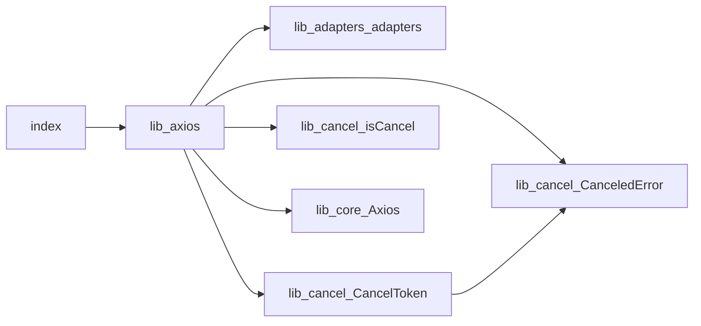
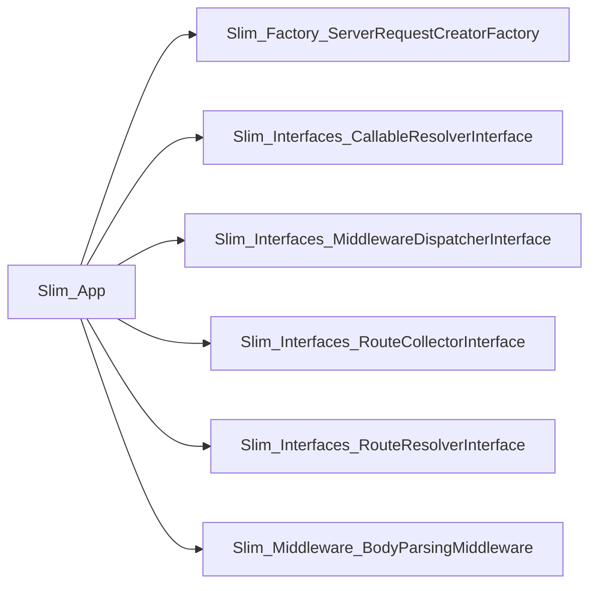

# Before / After: spine onboarding

This document shows the difference between the manual onboarding experience and what `spine` delivers.

## Why this matters

Without a verified onboarding layer, a developer must:

- read the repo README and inspect a handful of files manually
- hunt for the actual runtime entry point and call graph
- infer architecture edges across the codebase
- validate whether the diagram is correct by eyeballing it

With `spine`, the developer gets a verified architecture diagram plus a guided reading tour in one run.

---

## Example 1: `axios`

### Before

A new engineer opening `axios` typically starts by reading:

- `README.md`
- `package.json`
- `src/index.ts`
- `lib/adapters/xhr.ts`
- `lib/core/Axios.ts`

Then they must infer where the public API meets the runtime request flow.

### After

`spine` produces a deterministic `ONBOARDING.md` and a validated Mermaid diagram with a `mermaid.live` link.

```bash
npm run onboard -- benchmarks/repos/axios
```

This gives a developer:

- **TL;DR**: "This repository is a library built primarily in javascript, typescript. The verified spine currently runs through `index.js`, `lib/axios.js`, `lib/adapters/adapters.js`."
- **Architecture diagram**: Validated Mermaid showing 7 spine files with verified edges
- **Reading order**: 9 prioritized files to read first, including entry points and spine files
- **Mental model**: "Start from the exported surface and work inward; the stable public entry points are the fastest way to orient."

**Sample output:**


**Reading order:**
- `index.js` - This is a detected entry point, so it shows how execution begins.
- `lib/axios.js` - This file sits on the verified architecture spine and explains the main runtime handoff.
- `lib/adapters/adapters.js` - This file sits on the verified architecture spine and explains the main runtime handoff.
- `lib/cancel/CanceledError.js` - This file sits on the verified architecture spine and explains the main runtime handoff.
- `lib/cancel/CancelToken.js` - This file sits on the verified architecture spine and explains the main runtime handoff.
- `lib/cancel/isCancel.js` - This file sits on the verified architecture spine and explains the main runtime handoff.
- `lib/core/Axios.js` - This file sits on the verified architecture spine and explains the main runtime handoff.
- `README.md` - Defines a key project contract or context file.
- `package.json` - Defines a key project contract or context file.

---

## Example 2: `slim`

### Before

A PHP developer encountering the Slim framework might start by:

- Reading `README.md` for basic usage
- Looking at `composer.json` for dependencies
- Guessing at entry points like `Slim/App.php`
- Manually tracing through middleware and routing interfaces

### After

`spine` analyzes the PHP codebase and produces a complete onboarding guide.

```bash
npm run onboard -- benchmarks/repos/slim
```

**TL;DR**: "This repository is a library built primarily in php. The verified spine currently runs through `Slim/App.php`, `Slim/Factory/ServerRequestCreatorFactory.php`, `Slim/Interfaces/CallableResolverInterface.php`."

**Architecture diagram:**


**Reading order:**
- `Slim/App.php` - This is a detected entry point, so it shows how execution begins.
- `Slim/Factory/ServerRequestCreatorFactory.php` - This file sits on the verified architecture spine and explains the main runtime handoff.
- `Slim/Interfaces/CallableResolverInterface.php` - This file sits on the verified architecture spine and explains the main runtime handoff.
- `Slim/Interfaces/MiddlewareDispatcherInterface.php` - This file sits on the verified architecture spine and explains the main runtime handoff.
- `Slim/Interfaces/RouteCollectorInterface.php` - This file sits on the verified architecture spine and explains the main runtime handoff.
- `Slim/Interfaces/RouteResolverInterface.php` - This file sits on the verified architecture spine and explains the main runtime handoff.
- `Slim/Middleware/BodyParsingMiddleware.php` - This file sits on the verified architecture spine and explains the main runtime handoff.
- `README.md` - Defines a key project contract or context file.

- the raw `README.md` and file tree for a repo before `spine`
- the generated `ONBOARDING.md` after running `spine`
- the rendered Mermaid diagram from `mermaid.live`
